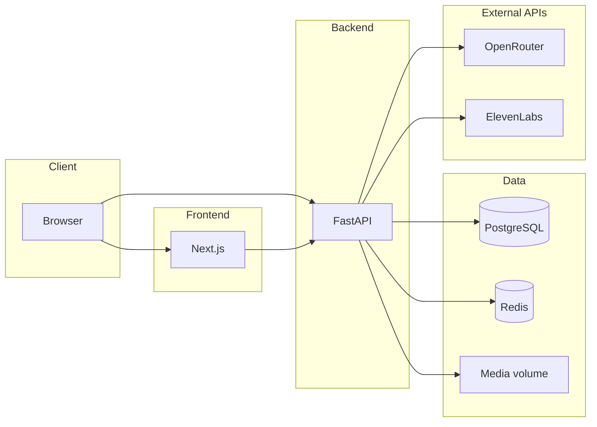

# Vellon AI — Technical Reference

This document describes the **implementation** of the Vellon AI stack: architecture, services, APIs, data layer, frontend, infrastructure, and operational concerns. It reflects the codebase as of the repository state; when behavior and comments diverge, the **code wins**.

---

## Table of contents

1. [High-level architecture](#1-high-level-architecture)
2. [Repository layout](#2-repository-layout)
3. [Backend runtime](#3-backend-runtime)
4. [Configuration and secrets](#4-configuration-and-secrets)
5. [HTTP API](#5-http-api)
6. [Authentication and authorization](#6-authentication-and-authorization)
7. [Data model (PostgreSQL)](#7-data-model-postgresql)
8. [Repositories and query patterns](#8-repositories-and-query-patterns)
9. [Redis usage](#9-redis-usage)
10. [AI layer (OpenRouter)](#10-ai-layer-openrouter)
11. [Voice and media (ElevenLabs + filesystem)](#11-voice-and-media-elevenlabs--filesystem)
12. [Usage metering and quotas](#12-usage-metering-and-quotas)
13. [Webhooks and billing hooks](#13-webhooks-and-billing-hooks)
14. [Middleware, CORS, and health](#14-middleware-cors-and-health)
15. [Database migrations](#15-database-migrations)
16. [Frontend (Next.js)](#16-frontend-nextjs)
17. [Docker and deployment](#17-docker-and-deployment)
18. [Testing](#18-testing)
19. [Extensibility and known gaps](#19-extensibility-and-known-gaps)

---

## 1. High-level architecture

Vellon AI is a **client–server** product:

- **Browser** → **Next.js** (App Router, React 18, TypeScript) for marketing pages, auth UI, and the authenticated dashboard.
- **Browser** → **FastAPI** REST API under `/api` for all business logic, persistence, and third-party AI/voice calls.
- **API** → **PostgreSQL 16** (async via SQLAlchemy + `asyncpg`) for durable data.
- **API** → **Redis 7** for refresh-token rotation state, AI response caching, embedding vector cache, per-IP HTTP rate limiting, and monthly AI usage counters.

Third-party services (optional):

- **OpenRouter** — chat completions (summaries, keywords, descriptions, translation, dashboard generation) and embeddings HTTP API.
- **ElevenLabs** — speech-to-text, text-to-speech, speech-to-speech.
- **Stripe** — webhook endpoint (signature verification only; no subscription state mutation in-app today).
- **Telegram** — webhook endpoint with optional secret header validation.



**Security boundary:** API keys for OpenRouter and ElevenLabs exist **only on the server**. The frontend receives JWT access tokens and never sees provider secrets.

---

## 2. Repository layout

| Path | Role |
|------|------|
| `backend/app/` | FastAPI application package |
| `backend/app/main.py` | App instance, lifespan, CORS, global rate limit, `/health`, `/ready` |
| `backend/app/api/` | Routers and FastAPI dependencies |
| `backend/app/core/` | Settings, security, rate-limit helpers, tenancy notes |
| `backend/app/db/` | SQLAlchemy models, session, Alembic migrations, repositories |
| `backend/app/integrations/redis/` | Redis client, cache helpers, pubsub stub |
| `backend/app/middlewares/` | IP-based rate limiting |
| `backend/app/services/` | Domain services: auth, AI, embeddings, ElevenLabs client, media storage |
| `backend/app/schemas/` | Pydantic request/response DTOs |
| `backend/tests/` | Pytest unit + integration tests |
| `frontend/src/app/` | Next.js App Router pages and layouts |
| `frontend/src/components/` | UI components (marketing, dashboard, voice, shadcn-style UI) |
| `frontend/src/lib/` | API client, utilities, motion helpers |
| `frontend/src/store/` | Zustand stores (auth) |
| `docker-compose.yml` | Dev stack: API, frontend, Postgres, Redis |
| `docker-compose.prod.yml` | Production overrides (no dev mounts, internal-only DB/Redis, production frontend image) |

---

## 3. Backend runtime

### 3.1 Stack

- **Python:** `>= 3.11` (`pyproject.toml`)
- **Framework:** FastAPI (`0.115.x`–`<0.129`)
- **ASGI server:** Uvicorn with standard extras
- **ORM:** SQLAlchemy 2.x async
- **DB driver:** `asyncpg` (URL scheme `postgresql+asyncpg://`)
- **Migrations:** Alembic
- **Validation / settings:** Pydantic v2, `pydantic-settings`
- **Auth:** PyJWT, bcrypt (password hashing)
- **HTTP client:** httpx (OpenRouter embeddings, ElevenLabs)
- **OpenAI SDK:** `openai` package pointed at OpenRouter base URL for chat
- **Optional:** Stripe SDK for webhooks; `arq` listed for future/async jobs

### 3.2 Application lifecycle

`app/main.py` defines an **async lifespan**:

1. On startup: `create_redis_client()` → stored as `app.state.redis`.
2. On shutdown: `close_redis_client(redis)`.

The API router is mounted at **`/api`**. Versioned routes live under **`/api/v1`**.

### 3.3 Request-scoped database session

`app/db/session.py`:

- Single `create_async_engine(settings.database_url, echo=settings.debug)`.
- `async_sessionmaker` with `autoflush=False`, `expire_on_commit=False`.
- `get_db_session()` dependency: yields `AsyncSession`, **commits on success**, **rolls back on exception**, closes in `finally`.

### 3.4 Layering convention

- **Routers** orchestrate HTTP, call **repositories** and **services**, enforce auth via **dependencies**.
- **Repositories** encapsulate SQLAlchemy queries; **all note/tag access is scoped by `user_id`**.
- **Services** hold cross-cutting logic (e.g. `AuthService`, `AINotConfiguredError`, ElevenLabs HTTP).

---

## 4. Configuration and secrets

All settings are loaded via **`app.core.config.Settings`** (`pydantic-settings`), reading environment variables and optional `.env` in the backend working directory.

| Variable | Purpose |
|----------|---------|
| `APP_ENV` | Logical environment name (default `development`) |
| `DEBUG` | SQLAlchemy `echo` for SQL logging |
| `SECRET_KEY` | JWT signing secret (**must be changed in production**) |
| `JWT_ALGORITHM` | Default `HS256` |
| `ACCESS_TOKEN_EXPIRES_MINUTES` | Access JWT lifetime |
| `REFRESH_TOKEN_EXPIRES_DAYS` | Refresh JWT lifetime |
| `REFRESH_COOKIE_NAME` | httpOnly cookie name for refresh token |
| `REFRESH_COOKIE_SECURE` | Cookie `Secure` flag (also forced when `app_env == production` in auth routes) |
| `DATABASE_URL` | Async Postgres URL |
| `REDIS_URL` | Redis connection URL |
| `OPENROUTER_API_KEY` | Optional; enables chat + embeddings paths |
| `OPENROUTER_CHAT_MODEL` | Default `openai/gpt-4o-mini` |
| `OPENROUTER_EMBED_MODEL` | Default `nvidia/llama-nemotron-embed-vl-1b-v2:free` |
| `AI_CACHE_TTL_SECONDS` | TTL for cached AI strings and embedding JSON in Redis |
| `MEDIA_ROOT` | Filesystem root for voice files (default `/app/media` in Docker) |
| `ELEVENLABS_API_KEY` | Optional; enables voice pipeline |
| `ELEVENLABS_STT_MODEL` | Default `scribe_v2` |
| `ELEVENLABS_TTS_VOICE_ID` / `ELEVENLABS_TTS_MODEL` | TTS defaults |
| `ELEVENLABS_STS_MODEL` | Speech-to-speech model |
| `VOICE_UPLOAD_MAX_BYTES` | Max upload size for voice memo audio |
| `RATE_LIMIT_AI_FREE` / `_PRO` / `_TEAM` | Monthly AI action caps per plan tier |
| `STRIPE_SECRET_KEY` / `STRIPE_WEBHOOK_SECRET` | Stripe (webhook verification) |
| `TELEGRAM_BOT_TOKEN` / `TELEGRAM_WEBHOOK_SECRET_TOKEN` | Telegram webhook verification |
| `TENANT_HEADER` / `TENANT_STRATEGY` | Reserved for future multi-tenant wiring |

Frontend:

| Variable | Purpose |
|----------|---------|
| `NEXT_PUBLIC_API_URL` | Base URL for API (default `http://localhost:8000` in dev) |
| `NEXT_PUBLIC_DEBUG_AUTH` | Optional Zustand rehydration logging |

---

## 5. HTTP API

Base paths:

- **Versioned API:** `/api/v1/...`
- **Liveness:** `GET /health` (no DB/Redis)
- **Readiness:** `GET /ready` (DB + Redis; **503** on failure)

### 5.1 Auth (`/api/v1/auth`)

| Method | Path | Description |
|--------|------|-------------|
| POST | `/register` | Create user; returns `TokenResponse`; sets refresh **httpOnly** cookie when Redis available |
| POST | `/login` | Same as register for tokens |
| POST | `/refresh` | Reads refresh JWT from **cookie first**, else body `refresh_token`; **rotates** refresh (one-time `jti` in Redis); new cookie |
| POST | `/logout` | Clears refresh cookie (**204**) |
| GET | `/me` | Current user profile (**Bearer** required) |
| GET | `/admin-only` | Example RBAC: `owner` or `admin` only |

**Token response:** JSON includes `access_token`, `token_type`, `expires_in`, and optionally `refresh_token` + `refresh_expires_in` (refresh also duplicated in cookie on login/register/refresh).

### 5.2 Notes (`/api/v1/notes`)

All routes require **Bearer** authentication unless noted. Ownership is enforced via `user_id` on every query.

| Method | Path | Description |
|--------|------|-------------|
| POST | `` | Create text note (`NoteCreateInput`) |
| POST | `/voice` | **Multipart:** `audio` file + optional `title` form field; creates note, stores audio, transcribes via ElevenLabs |
| GET | `/counts` | Sidebar counts: `all`, `archived`, `pinned`, `favorite`, `deleted` |
| GET | `` | List notes: query params `limit`, `offset`, `archived`, `deleted`, `favorite`, `pinned`, `q`, `tag_id` |
| POST | `/reorder` | `note_ids` array → updates `sort_order` |
| GET | `/{note_id}` | Single note with tags |
| GET | `/{note_id}/audio` | Stream **original** voice recording (`FileResponse`) |
| GET | `/{note_id}/audio/sts` | Stream **speech-to-speech** MP3 if present |
| PUT | `/{note_id}` | Partial update (`NoteUpdateInput`) |
| DELETE | `/{note_id}` | **Soft delete** (`is_deleted = true`, **204**) |
| POST | `/{note_id}/tags/{tag_id}` | Attach tag |
| DELETE | `/{note_id}/tags/{tag_id}` | Detach tag (**204**) |
| GET | `/{note_id}/summary` | AI summary (cache → else OpenRouter); quota-gated |
| GET | `/{note_id}/keywords` | AI keywords JSON list; cache; quota-gated |
| GET | `/{note_id}/describe` | AI description of **voice transcript**; cache; quota-gated |
| POST | `/{note_id}/embeddings` | Generate or return cached embedding **metadata** (vector in Redis only); quota-gated |
| POST | `/{note_id}/retranscribe` | Re-run STT from stored audio |
| POST | `/{note_id}/translate` | Translate `content` → `translated_text` |
| POST | `/{note_id}/tts` | TTS stream (`NoteTtsInput`: `content` \| `translated` \| `custom`) |
| POST | `/{note_id}/speech-to-speech` | STS from stored audio; saves `sts_output.mp3` under media root |

**Query parameters (list notes):**

- `limit` — 1–200, default 100  
- `offset` — ≥ 0  
- `archived` — optional boolean filter  
- `deleted` — boolean; **true** = trash view (`is_deleted`)  
- `favorite`, `pinned` — optional boolean filters  
- `q` — search string; **ILIKE** on `title`, `content`, `translated_text`  
- `tag_id` — filter notes having that tag (join on `note_tags`)

### 5.3 Tags (`/api/v1/tags`)

| Method | Path | Description |
|--------|------|-------------|
| GET | `` | List current user’s tags |
| POST | `` | Create tag; **409** if name exists for user |

Note–tag linking is on the **notes** router (see above).

### 5.4 AI (`/api/v1/ai`)

| Method | Path | Description |
|--------|------|-------------|
| POST | `/generate` | Body: `prompt_type` ∈ `brainstorm` \| `draft_summary`, optional `seed`; quota-gated |

### 5.5 Usage (`/api/v1/usage`)

| Method | Path | Description |
|--------|------|-------------|
| GET | `/quota` | `plan`, `limit`, `used`, `remaining`, `reset_period_end` (ISO) |

**Implementation note:** quota computation currently passes **`plan="free"`** for all users in the route handler; AI enforcement uses `check_and_increment_ai_usage(redis, user.id)` which **defaults to `plan="free"`** unless extended. Pro/team limits exist in settings but are not yet driven by per-user subscription state.

### 5.6 Webhooks (`/api/v1/webhooks`)

| Method | Path | Description |
|--------|------|-------------|
| POST | `/stripe` | Raw body + `Stripe-Signature`; verifies with `STRIPE_WEBHOOK_SECRET`; **200** (no DB updates) |
| POST | `/telegram` | Optional `X-Telegram-Bot-Api-Secret-Token` check; reads JSON; **200** |

---

## 6. Authentication and authorization

### 6.1 Passwords

- `hash_password` / `verify_password` in `app/core/security.py` use **bcrypt**.
- Passwords are truncated to **72 bytes** before hashing (bcrypt limit).

### 6.2 JWT access token

- Claims: `sub` (user UUID string), `exp`, `iat`.
- Signed with `SECRET_KEY` and `JWT_ALGORITHM`.

### 6.3 JWT refresh token

- Claims: `sub`, `jti`, `type: "refresh"`, `exp`, `iat`.
- **Rotation:** On refresh, the old `jti` must exist in Redis under `refresh:{jti}`; it is **deleted** (one-time use). A new `jti` is stored with TTL matching refresh lifetime.

### 6.4 HTTP API auth

- `HTTPBearer(auto_error=True)` in `get_current_user`.
- Invalid/expired access token → **401**.
- Missing user row for `sub` → **401**.

### 6.5 RBAC

- `require_roles(["owner", "admin"])` returns **403** if `user.role` not in list.
- New registrations set `role="owner"` in `AuthService.register`.

---

## 7. Data model (PostgreSQL)

### 7.1 `users`

- `id` (UUID PK), `email` (unique, indexed), `hashed_password`, `role` (`owner` \| `admin` \| `member`), `display_name`, `avatar_url`, timestamps.

### 7.2 `notes`

- `id`, `user_id` (FK → `users`, CASCADE), `title`, `content` (required text), `source` (default `web`), flags: `is_archived`, `is_deleted`, `is_favorite`, `is_pinned`, `sort_order`.
- **Voice / translation (migration 011):** `voice_audio_path`, `voice_audio_mime`, `voice_duration_seconds`, `voice_status`, `voice_error`, `transcript_language`, `translated_text`, `sts_audio_path`.
- Indexes: `user_id`, `created_at`, `sort_order`.

**Computed response fields** (not DB columns): `voice_audio_available`, `sts_audio_available` (ORM `@property` → exposed in `NoteResponse`).

### 7.3 `tags`

- `id`, `user_id`, `name`; **unique** (`user_id`, `name`).

### 7.4 `note_tags`

- Composite PK (`note_id`, `tag_id`), CASCADE to notes and tags.

### 7.5 `usage_logs`

- Append-only analytics/billing-oriented log: `user_id` (nullable, SET NULL on user delete), `action_type`, `quantity`, `metadata` (JSON text), timestamps.
- Observed `action_type` values in routes: `ai_action`, `ai_action_blocked`.

---

## 8. Repositories and query patterns

### 8.1 `NoteRepository`

- **Create:** `sort_order = max(sort_order) + 1` among non-deleted notes for user.
- **List default:** excludes `is_deleted` unless `deleted_only=True`.
- **Order:** `sort_order ASC`, then `updated_at DESC`.
- **Search:** case-insensitive pattern match on title, content, translated text.
- **Tag filter:** `JOIN note_tags` when `tag_id` set.
- **Update:** whitelist `_updatable_note_attrs` only.
- **Soft delete:** sets `is_deleted=True` (retrieve with `include_deleted=True` where needed).

### 8.2 `TagRepository`

- List ordered by name.
- `attach_to_note` uses PostgreSQL `INSERT ... ON CONFLICT DO NOTHING` for idempotency.

### 8.3 `UserRepository` / `UsageLogRepository`

- Standard CRUD / append patterns as described in source files.

---

## 9. Redis usage

| Key pattern | Purpose |
|-------------|---------|
| `refresh:{jti}` | Refresh token valid flag; TTL = refresh token lifetime |
| `summarize:{note_id}` | Cached AI summary string |
| `keywords:{note_id}` | Cached keywords JSON array string |
| `describe:{note_id}` | Cached voice-memo description string |
| `embedding:{note_id}` | JSON `{"embedding": [...], "dimension": N}` — **full vector only in Redis** |
| `usage:ai:{user_id}:{YYYY-MM}` | Monthly AI counter; TTL until end of month |
| `rl:ip:{client_ip}:{YYYY-MM-DD-HH-MM}` | Per-minute request count for global middleware |

**Cache invalidation:** Updating note `title`, `content`, or `translated_text` deletes summary, keywords, and description cache keys for that note.

---

## 10. AI layer (OpenRouter)

### 10.1 Chat client

`get_openrouter_client()` returns `AsyncOpenAI` with:

- `base_url = https://openrouter.ai/api/v1`
- `api_key = settings.openrouter_api_key`

### 10.2 Capabilities (`app/services/ai.py`)

| Function | Behavior |
|----------|----------|
| `summarize_text` | 1–3 sentence summary; content truncated ~8k chars |
| `extract_keywords` | Model asked for JSON array; parser strips markdown fences; max 20 strings |
| `describe_voice_memo` | Richer narrative from transcript |
| `translate_text` | Target language from user input string |
| `generate_for_prompt` | `brainstorm` or `draft_summary` for dashboard |

### 10.3 Embeddings (`app/services/embeddings.py`)

- **POST** `https://openrouter.ai/api/v1/embeddings` via httpx (not the OpenAI SDK).
- Input truncated to 8192 chars.
- Result cached in Redis as JSON.

### 10.4 Errors

- Missing API key → `AINotConfiguredError` / `OpenRouterNotConfiguredError` → routes map to **503** with explicit `detail`.

---

## 11. Voice and media (ElevenLabs + filesystem)

### 11.1 Client (`app/services/elevenlabs_client.py`)

- **STT:** `POST /v1/speech-to-text` multipart `file` + `model_id`.
- **TTS:** `POST /v1/text-to-speech/{voice_id}` JSON body, `output_format=mp3_44100_128`.
- **STS:** `POST /v1/speech-to-speech/{voice_id}`; retries with alternate multipart field name on **422**.

### 11.2 Storage (`app/services/media_storage.py`)

- Root: `settings.media_root` (resolved as `Path`).
- Layout: `{media_root}/{user_id}/{note_id}/original.{ext}` and `sts_output.mp3`.
- `abs_media_path` resolves relative paths and **rejects** `..` and absolute paths to limit path traversal.

### 11.3 Voice note lifecycle

1. Create note placeholder with `source="voice"`, interim content.
2. Save bytes to disk; update DB with path, mime, `voice_status="transcribing"`.
3. On STT success: update `content`, `voice_status="ready"`, language, duration.
4. On failure: user-facing error content, `voice_status="failed"`, `voice_error` snippet.

---

## 12. Usage metering and quotas

### 12.1 Monthly counter

`check_and_increment_ai_usage(redis, user_id, plan="free")`:

1. Increments `usage:ai:{user_id}:{YYYY-MM}`.
2. Sets TTL to end of current UTC month.
3. If count **exceeds** limit for plan → `RateLimitExceeded` → HTTP **429** from routes.

### 12.2 Usage logs

Successful AI operations and some blocked attempts call `UsageLogRepository.log(...)`.

### 12.3 Plan limits (config)

- `rate_limit_ai_free` (default 50), `rate_limit_ai_pro` (500), `rate_limit_ai_team` (2000) — **per calendar month**, not calendar billing cycle tied to Stripe yet.

---

## 13. Webhooks and billing hooks

- **Stripe:** Signature verification only; suitable for future subscription sync.
- **Telegram:** Secret token optional; body accepted; **200** response (processing deferred to workers if added).

---

## 14. Middleware, CORS, and health

### 14.1 CORS

- Allowed origins: `http://localhost:3000`, `http://127.0.0.1:3000`.
- `allow_credentials=True`, methods and headers wildcard.

**Production note:** behind a custom domain, CORS origins must be extended in code or via configuration refactor.

### 14.2 Global rate limit (`RateLimitMiddleware`)

- Per **client IP**, per **minute** window key.
- Default **300** requests/minute/IP.
- Uses `INCR` + `EXPIRE 60` on first hit.
- On Redis errors in middleware, failures are **swallowed** (request proceeds).

### 14.3 Readiness

`/ready` creates a **new** async engine, runs `SELECT 1`, disposes, then pings Redis from `app.state.redis`.

---

## 15. Database migrations

Alembic revisions under `backend/app/db/migrations/versions/` (chronological themes):

1. **001** — user hashed password  
2. **002** — note model  
3. **003** — note soft delete  
4. **004** — user role  
5. **005–007** — organization/plan fields (historical; later removed)  
6. **008** — remove organizations  
7. **006** (usage_logs) / **009** — avatar URL  
8. **010** — favorites, pinned, sort order, tags + `note_tags`  
9. **011** — voice fields, translation, STS path  

Docker **dev** command runs `alembic upgrade head` before Uvicorn.

---

## 16. Frontend (Next.js)

### 16.1 Stack

- **Next.js** 16 (App Router), **React** 18, **TypeScript**
- **Styling:** Tailwind CSS 3, `tailwind-merge`, `class-variance-authority`, `clsx`
- **UI:** Radix Slot, custom `components/ui/*` (button, input, card, spinner)
- **Motion:** `framer-motion`, `motion`
- **Forms:** `react-hook-form`, `@hookform/resolvers`, `zod`
- **HTTP:** `axios` singleton in `src/lib/api.ts`
- **State:** `zustand` + `persist` for auth

### 16.2 Build

- `next.config.mjs`: `output: 'standalone'` for container-friendly production builds.
- Remote images allowed for `images.unsplash.com`.

### 16.3 Routing

| Route | Role |
|-------|------|
| `/` | Marketing landing (hero, features, motion) |
| `/login`, `/signin`, `/register` | Auth pages |
| `/dashboard` | Main notes UI |
| `/dashboard/notes/[id]` | Note detail / editor / voice |
| `/dashboard/settings` | Settings |

### 16.4 API client (`src/lib/api.ts`)

- `baseURL = NEXT_PUBLIC_API_URL || http://localhost:8000`
- `withCredentials: true` for refresh cookie
- Request interceptor: attaches `Authorization: Bearer {accessToken}` from Zustand; strips `Content-Type` for `FormData`
- Response interceptor: on **401**, POST `/api/v1/auth/refresh` with optional body refresh + cookies; updates tokens; retries once

### 16.5 Auth store (`src/store/auth.ts`)

- Persists: `accessToken`, `user`, `isAuthenticated` — **not** `refreshToken` (refresh expected via httpOnly cookie).
- `hasHydrated` flag after rehydration for SSR/client guards.

### 16.6 Notable UI modules

- `VoiceMemoRecorder.tsx` + `live-waveform.tsx` — capture and upload voice memos
- `KeywordRichEditor.tsx`, `keyword-extractor.ts` — editor / keyword UX
- `NotesList.tsx`, `Sidebar.tsx`, `CreateNote.tsx` — dashboard shell
- `lib/note-kind.ts` — note type/kind helpers for UI

---

## 17. Docker and deployment

### 17.1 Development (`docker-compose.yml`)

- **api:** builds `backend/docker/api/Dockerfile`, mounts `backend/app` and `backend/media`, runs migrations + Uvicorn `--reload`
- **frontend:** `frontend/Dockerfile.dev`, bind-mounts source, named volume for `node_modules`
- **postgres:** port `POSTGRES_PORT` (default 5432)
- **redis:** port `REDIS_PORT` (default 6379)
- Frontend env: `NEXT_PUBLIC_API_URL=http://localhost:${API_PORT:-8000}`

### 17.2 Production overlay (`docker-compose.prod.yml`)

- Removes dev volumes and reload
- API: no host port (use reverse proxy)
- Frontend: build with `frontend/Dockerfile` (production), `NEXT_PUBLIC_API_URL` must point to public API URL
- Postgres/Redis: **no** host ports

### 17.3 Backend container resources

Compose sets memory limits/reservations for api, frontend, postgres, redis (see YAML).

---

## 18. Testing

- **Runner:** pytest with `asyncio_mode = auto`
- **Layout:** `backend/tests/unit`, `backend/tests/integration`, `backend/tests/e2e` (placeholder)
- **Markers:** `integration` for DB/Redis tests
- **Examples:** `test_auth.py`, `test_notes.py`, `test_usage.py`, security and repository unit tests

Run (from `backend/` with dev dependencies):

```bash
pytest
```

---

## 19. Extensibility and known gaps

1. **Multi-tenancy:** `app/core/tenancy.py` and settings `tenant_header` / `tenant_strategy` are **documentation stubs**; queries are **not** tenant-scoped beyond `user_id`.
2. **Plans:** Quota **display** and **enforcement** default to **free** tier limits for all users until subscription/plan is stored per user and threaded into `check_and_increment_ai_usage` and `GET /usage/quota`.
3. **Embeddings:** Vectors are **cached in Redis only**; there is **no** pgvector / similarity search — list search remains **SQL ILIKE**.
4. **Stripe:** Webhook does not update `users` or a `subscriptions` table.
5. **Telegram:** Webhook does not enqueue work; no bot handler in-repo.
6. **CORS:** Hardcoded localhost origins — needs change for staging/production domains.
7. **Workers:** `arq` and `workers/` package structure exist as scaffolding; heavy AI/voice work is **inline** in request handlers today.
8. **Security hardening:** Rate-limit middleware bypasses on Redis errors; consider fail-closed for high-risk deployments.

---

## Document maintenance

When you add routes, models, or env vars, update this file in the same PR so operators and contributors keep a single technical source of truth alongside the code.
